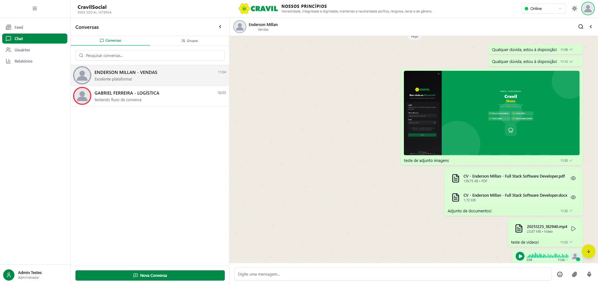
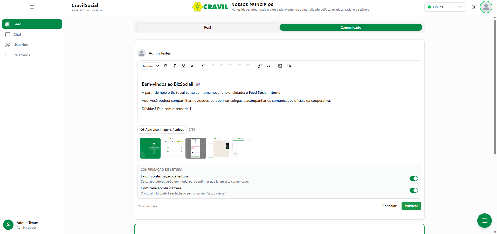
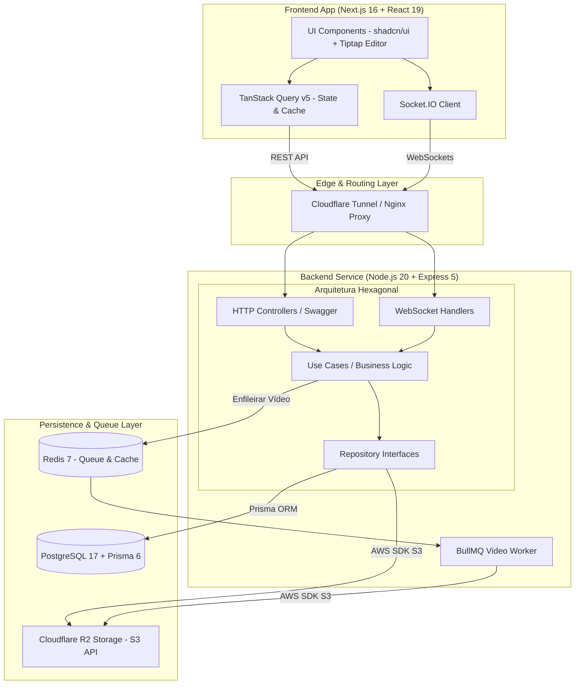

# 💬 BizSocial — Enterprise Real-Time Communication & Social Platform

> **📌 Showcase / Case Study Técnico (White-Label Product)**  
> Este repositório é uma demonstração de arquitetura e estudo de caso do **BizSocial**, uma plataforma corporativa de comunicação e rede social interna desenvolvida para ambientes enterprise e aplicada em produção para a **CRAVIL (Cooperativa Regional Agropecuária Vale do Itajaí)**. O código-fonte proprietário com regras de negócio específicas é confidencial, mas este documento detalha as decisões de engenharia, arquitetura de software e a stack de alta performance utilizada no ecossistema de produção.

---

<p align="center">
  
  
  
  
  
  
  
  
</p>

---

## 🎯 Sobre o Projeto & Impacto de Negócio

O **BizSocial** é uma plataforma corporativa unificada de rede social interna e comunicação em tempo real (ESN — *Enterprise Social Network*), projetada para conectar e engajar colaboradores distribuídos por **mais de 50 filiais operacionais** em Santa Catarina.

### 💡 Problemas Resolvidos:
* **Centralização e Governança da Comunicação:** Substituição de canais informais e não auditáveis por uma plataforma corporativa segura com logs de auditoria e relatórios administrativos.
* **Comunicação Bidirecional em Tempo Real:** Troca instantânea de mensagens 1-on-1 e em grupos setoriais, com confirmação de leitura, notas de voz, anexos e indicador de presença online.
* **Feed Social Corporativo & Comunicados:** Publicação oficial de comunicados com confirmação de leitura obrigatória, feed de interações, editor rico e automação de posts diários (ex.: aniversariantes).

---

## 📸 Demonstração Visual (UI / UX)

| Interface de Chat & Comunicação em Tempo Real | Feed Corporativo, Editor Rico & Mídia |
| :---: | :---: |
|  |  |

---

## 🏗️ Arquitetura de Software & Diagrama do Sistema

O backend do **BizSocial** foi estruturado sob os princípios da **Arquitetura Hexagonal Modular (Ports & Adapters)**, garantindo desacoplamento entre as regras de negócio, meios de transporte (REST / WebSockets) e trabalhadores assíncronos em background.


## 🛠️ Tech Stack Completa

### Frontend Ecosystem
- **Core:** Next.js 16.1 (App Router), React 19.1, TypeScript 5.8
- **Styling & UI:** Tailwind CSS v4, shadcn/ui, Radix UI
- **Rich Text Editor:** Tiptap v2 (suporte a imagens, vídeos e embeds no feed)
- **State Management & Data Fetching:** TanStack Query v5 (React Query)
- **Form & Validation:** React Hook Form v7, Zod v4
- **Real-time Engine:** Socket.IO Client v4.8
- **Testing:** Vitest v4

### Backend & Infrastructure
- **Runtime & Framework:** Node.js 20+, Express 5.1.0 (Arquitetura Hexagonal Modular)
- **Database & ORM:** PostgreSQL 17, Prisma ORM 6.17
- **Background Jobs & Queues:** BullMQ + Redis 7 (processamento e compressão assíncrona de vídeos)
- **Real-time Protocol:** Socket.IO v4.8 (WebSockets)
- **Authentication:** Stateless JWT Auth (jsonwebtoken)
- **Cloud Storage:** Storage híbrido (Local / Cloudflare R2 via AWS SDK S3 v3)
- **Containerization & Proxy:** Docker Compose, Nginx, Cloudflare Tunnel
- **Observability & Docs:** Swagger UI (OpenAPI 3.0), Logs de Auditoria

---

## ⚡ Destaques da Engenharia & Decisões Técnicas

1. **Processamento Assíncrono de Vídeos (BullMQ + Redis 7)**  
   Para evitar gargalos na API principal durante o upload de mídias pesadas no feed social, a compressão e transcodificação de vídeos é delegada para filas de processamento em background orquestradas pelo BullMQ e Redis.

2. **Comunicação Bidirecional de Baixa Latência (Socket.IO)**  
   Engine de WebSockets para suporte a chats 1-on-1 e grupos setoriais, notas de voz, confirmações de leitura em tempo real e verificação do estado de presença de usuários com reconexão automática.

3. **Arquitetura Hexagonal & Módulos Isolados**  
   O backend é totalmente desacoplado em módulos independentes (`auth`, `chat`, `group`, `feed`, `audit`), facilitando a manutenção, criação de rotinas automatizadas (cron de aniversariantes) e escrita de testes unitários e de integração com Vitest.

4. **Storage Otimizado com Custo Egress Zero (Cloudflare R2)**  
   Abstração da API S3 da AWS com Cloudflare R2 para distribuição de anexos operacionais entre as filiais, eliminando custos de transferência de saída de dados (*egress fees*).

---

## 📂 Estrutura Modular do Projeto

```text
├── app/
│   ├── backend/                  # API Node.js + Express (Arquitetura Hexagonal)
│   │   ├── src/
│   │   │   ├── app/modules/      # Módulos isolados (auth, chat, group, audit, feed)
│   │   │   ├── infrastructure/   # Adaptadores (HTTP, WebSocket, Storage, DB, BullMQ)
│   │   │   └── config/           # Swagger UI & configurações gerais
│   │   └── prisma/               # Schema e migrações PostgreSQL 17
│   ├── frontend/                 # Next.js 16 App Router + React 19
│   │   └── src/
│   │       ├── app/              # Rotas e páginas da aplicação
│   │       ├── _components/      # Componentes modulares (shadcn/ui, Tiptap)
│   │       └── _hooks/           # Custom hooks & TanStack Query integrations
│   └── docker-compose.yml        # Orquestração do ambiente (PostgreSQL, Redis)
└── nginx/                        # Configuração de proxy reverso & SSL
```

## 🧪 Suíte de Testes

O projeto conta com testes unitários e de integração focados na camada de domínio e casos de uso:

```bash
# Execução dos testes via Vitest
pnpm vitest run --reporter=verbose "feed"
pnpm vitest run --reporter=verbose "message"
pnpm vitest run --reporter=verbose "group"
```
## 📄 Licença & Direitos Autorais

> **Proprietário — Todos os direitos reservados.**  
> Este repositório é publicado exclusivamente para fins de demonstração de arquitetura de software e portfólio técnico de um sistema desenvolvido sob encomenda para cliente privado.

- **Propriedade Intelectual:** Todo o código-fonte, estrutura de banco de dados, regras de negócio e marcas registradas são de propriedade privada e confidencial do cliente.
- **Restrição de Uso:** É estritamente proibida qualquer cópia, distribuição, modificação, reprodução ou exploração comercial deste código, no todo ou em parte, sem autorização prévia e expressa por escrito.
- **Finalidade:** Exposição de decisões de engenharia, padrões de projeto (*Design Patterns*) e domínio de stack tecnológica para avaliação de senioridade técnica.

## ✉️ Contato & Soluções Corporativas

Interessado em arquitetar ou desenvolver uma plataforma SaaS/Full Stack escalável para a sua empresa? Vamos conversar:

- 🌐 **Portfólio:** [endersonmillan.com](https://endersonmillan.com)
- 💼 **LinkedIn:** [linkedin.com/in/enderson-millan](https://www.linkedin.com/in/enderson-millan)
- ✉️ **E-mail:** [millanendersondev@gmail.com](mailto:millanendersondev@gmail.com)

