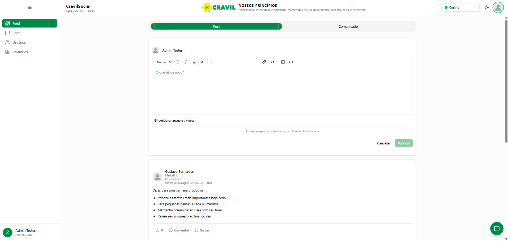
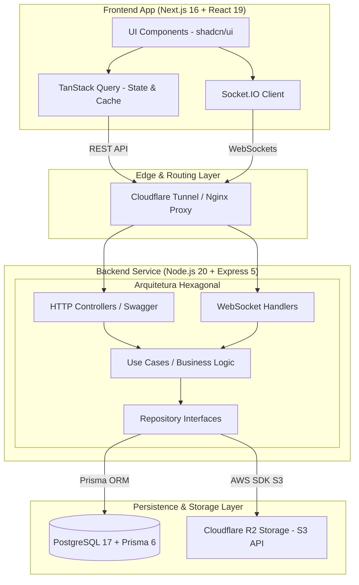

# 💬 Social Business — Enterprise Real-Time Communication & Social Platform

> **📌 Showcase / Case Study Técnico (White-Label Product)**  
> Este repositório é uma demonstração de arquitetura e estudo de caso do **Social Business**, uma plataforma de comunicação corporativa proprietária desenvolvida e aplicada em produção para a **CRAVIL (Cooperativa Regional Agropecuária Vale do Itajaí)**. O código-fonte original de regras de negócio é confidencial, mas este documento detalha as decisões de engenharia, arquitetura de sistemas e stack utilizada no ecossistema de produção.

---

<p align="center">
  
  
  
  
  
  
  
  
</p>

---

## 🎯 Sobre o Projeto & Impacto de Negócio

O **Social Business** é uma plataforma corporativa unificada de rede social e comunicação em tempo real projetada para conectar e engajar colaboradores distribuídos por **mais de 50 filiais operacionais** em Santa Catarina.

### 💡 Problemas Resolvidos:
* **Descentralização da Comunicação:** Substituição de canais informais e não auditáveis por uma plataforma interna segura e parametrizável.
* **Comunicação em Tempo Real:** Troca instantânea de mensagens individuais e em grupos setoriais com confirmações de leitura e presença de status.
* **Transferência de Arquivos Segura:** Gestão e distribuição eficiente de anexos operacionais através de storage em nuvem otimizado.

---

## 📸 Demonstração Visual (UI / UX)

| Interface de Conversas & Grupos | Feed Corporativo & Anexos |
| :---: | :---: |
|  |  |

---

## 🏗️ Arquitetura de Software & Diagrama do Sistema

O backend foi estruturado sob os princípios da **Arquitetura Hexagonal Modular (Ports & Adapters)**, garantindo desacoplamento total entre as regras de negócio centrais, os meios de transporte (REST / WebSockets) e os adaptadores de infraestrutura (Prisma ORM, S3/Cloudflare R2, JWT).



## 🛠️ Tech Stack Completa

### Frontend Ecosystem
- **Core:** Next.js 16 (App Router), React 19, TypeScript 5.8
- **Styling & UI:** Tailwind CSS v4, shadcn/ui, Radix UI
- **State Management & Data Fetching:** TanStack Query v5 (React Query)
- **Form & Validation:** React Hook Form v7, Zod v4
- **Real-time Engine:** Socket.IO Client v4.8
- **Testing:** Vitest v4

### Backend & Infrastructure
- **Runtime & Framework:** Node.js 20+, Express 5.1.0, TypeScript 5.8
- **Database & ORM:** PostgreSQL 17, Prisma ORM 6.17
- **Real-time Protocol:** Socket.IO v4.8 (WebSockets)
- **Authentication:** Stateless JWT Auth (jsonwebtoken)
- **Cloud Storage:** Storage híbrido (Local / Cloudflare R2 via AWS SDK S3 v3)
- **Containerization & Proxy:** Docker Compose, Nginx, Cloudflare Tunnel
- **Observability & Docs:** Swagger UI (OpenAPI 3.0), Winster/Morgan Logging

---

## ⚡ Destaques da Engenharia & Decisões Técnicas

1. **Comunicação Bidirecional com Socket.IO**  
   Integração de servidor WebSockets gerenciado para comunicação em tempo real, suportando envio de mensagens 1-on-1, transmissões em grupos, notificações push instantâneas e verificação de usuários online/offline com reconexão automática e resiliência a falhas de rede.

2. **Storage Otimizado com Cloudflare R2 (Zero Egress Fees)**  
   Para reduzir os custos operacionais com transferência de arquivos e mídia pesada entre as filiais, o sistema utiliza uma camada de abstração com a API S3 da AWS integrada ao Cloudflare R2, eliminando taxas de transferência de dados de saída (egress fees).

3. **Pipeline de Backup e Tolerância a Falhas**  
   Desenvolvimento de um sistema personalizado de scripts de automação em PowerShell integrados a rotinas agendadas no servidor local para backup contínuo do banco de dados PostgreSQL 17, gerenciamento de snapshots e restauração rápida em ambientes isolados.

---

## 📂 Estrutura de Pastas do Projeto Original

```text
├── app/
│   ├── backend/                 # API Node.js + Express
│   │   ├── src/
│   │   │   ├── app/modules/     # Módulos isolados (auth, chat, group)
│   │   │   ├── infrastructure/  # Adaptadores (HTTP, WebSocket, Storage, DB)
│   │   │   └── config/          # Swagger UI & configurações gerais
│   │   └── prisma/              # Schemas e migrações do PostgreSQL
│   ├── frontend/                # Next.js 16 App Router
│   │   └── src/
│   │       ├── app/             # Rotas e páginas da aplicação
│   │       ├── components/      # Componentes modulares reutilizáveis
│   │       └── hooks/           # Custom hooks & TanStack Query integrations
│   └── docker-compose.yml       # Orquestração do ambiente
└── nginx/                       # Configuração de proxy reverso
```
## 👨‍💻 Autor & Engenharia de Software

**Enderson Millan** — *Software Engineer / Full Stack Developer*

- 🌐 **Website / Portfólio:** [endersonmillan.com](https://www.endersonmillan.com/)
- 💼 **LinkedIn:** [linkedin.com/in/enderson-millan](https://www.linkedin.com/in/enderson-millan)
- ✉️ **E-mail:** [millanendersondev@gmail.com](mailto:millanendersondev@gmail.com)
- 📺 **YouTube:** [@millanendersondev](https://www.youtube.com/@millanendersondev)
